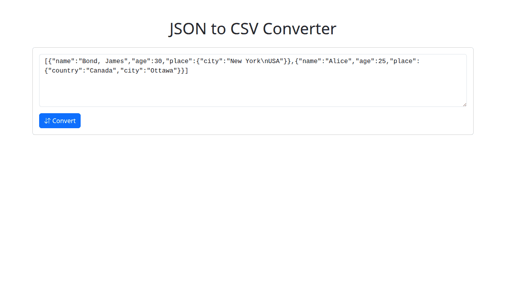

# JSON to CSV Converter

This tool converts JSON data into Comma Separated Values (CSV) format. It can also prepare the data for easy pasting into spreadsheet applications like Excel by converting it to Tab Separated Values (TSV).

## What it does

The tool takes JSON input, processes it, and converts it into a tabular CSV structure.
Key features include:

- **JSON Input:** Accepts a JSON array of objects or a single JSON object.
- **Nested Object Flattening:** Automatically flattens nested JSON objects, creating new column headers with a dot notation (e.g., `parent.child.field`).
- **CSV Output:** Generates standard CSV formatted text.
- **Table Preview:** Displays the converted data in an HTML table for immediate review.
- **TSV for Excel:** Provides an option to copy the data as Tab Separated Values, which is ideal for pasting directly into spreadsheet software.

## Use Cases

- **Data Import/Export:** Convert JSON data from APIs or databases into CSV format for import into spreadsheets (Excel, Google Sheets), databases, or other data analysis tools.
- **Spreadsheet Analysis:** Quickly transform JSON data into a format suitable for analysis and manipulation in spreadsheet software.
- **Data Interchange:** Prepare JSON data for systems that primarily consume CSV files.
- **Simplifying Data Structures:** Flatten complex, nested JSON into a simple, two-dimensional table.

## How It Works

1.  **Input JSON:**

    - The user pastes their JSON data into the provided textarea.
    - The input can be a JSON array (e.g., `[{"id": 1}, {"id": 2}]`) or a single JSON object (e.g., `{"id": 1, "name": "Test"}`). If a single object is provided, it's treated as an array with one element.
    - Sample JSON is pre-loaded to demonstrate the expected format.

2.  **Convert:**

    - The user clicks the "Convert" button.
    - The tool parses the JSON. If the JSON is invalid, an error message is shown.
    - Nested objects are flattened (e.g., `{"user": {"name": "John"}}` becomes a column `user.name` with value `John`).
    - The converted data is displayed as an HTML table.
    - The "Download CSV" and "Copy to Excel" buttons become active.

3.  **Export/Copy:**
    - **Download CSV:** Clicking "Download CSV" prompts the user to save a `.csv` file containing the converted data.
    - **Copy to Excel:** Clicking "Copy to Excel" copies the data to the clipboard in TSV format. This can then be pasted directly into applications like Microsoft Excel or Google Sheets. A confirmation toast message appears.

The tool utilizes the D3.js library (`d3-dsv`) for robust CSV and TSV formatting.
